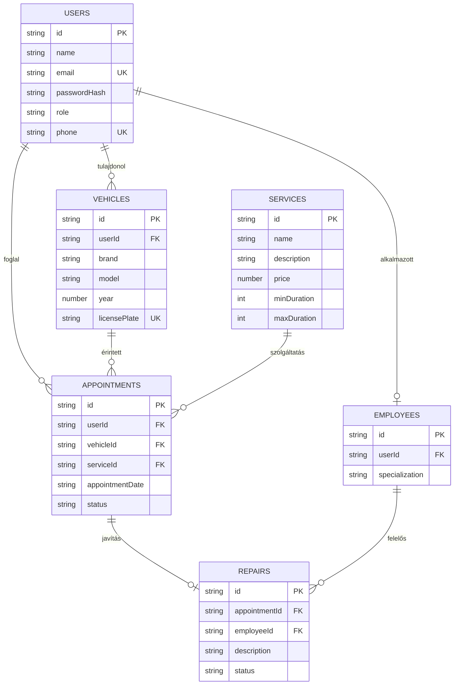

## ER Diagram

```mermaid
erDiagram
    USERS ||--o{ VEHICLES : "tulajdonol"
    USERS ||--o{ APPOINTMENTS : "foglal"
    USERS ||--o| EMPLOYEES : "alkalmazott"
    VEHICLES ||--o{ APPOINTMENTS : "érintett"
    SERVICES ||--o{ APPOINTMENTS : "szolgáltatás"
    APPOINTMENTS ||--o| REPAIRS : "javítás"
    EMPLOYEES ||--o{ REPAIRS : "felelős"

    USERS {
        string id PK
        string name
        string email UK
        string passwordHash
        string role
        string phone UK
    }

    VEHICLES {
        string id PK
        string userId FK
        string brand
        string model
        number year
        string licensePlate UK
    }

    EMPLOYEES {
        string id PK
        string userId FK
        string specialization
    }

    SERVICES {
        string id PK
        string name
        string description
        number price
        int minDuration
        int maxDuration
    }

    APPOINTMENTS {
        string id PK
        string userId FK
        string vehicleId FK
        string serviceId FK
        string appointmentDate
        string status
    }

    REPAIRS {
        string id PK
        string appointmentId FK
        string employeeId FK
        string description
        string status
    }

```
